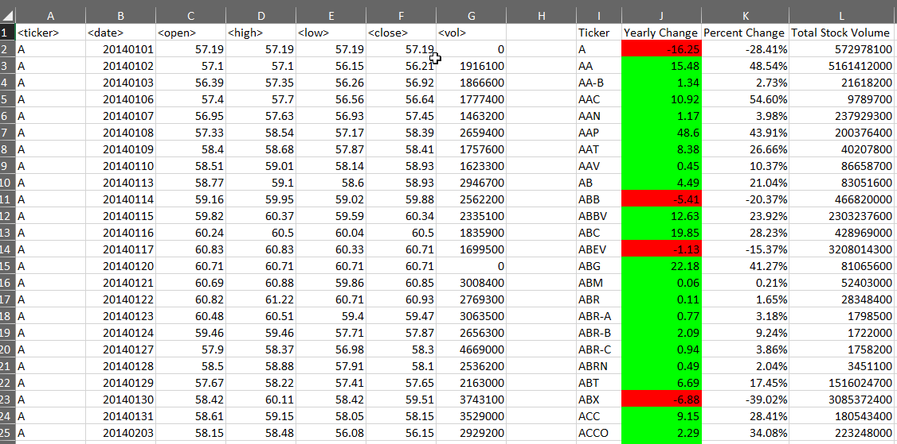
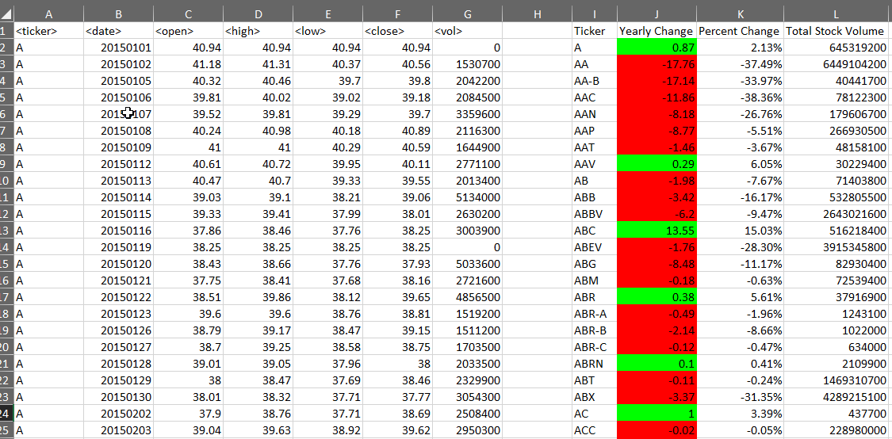
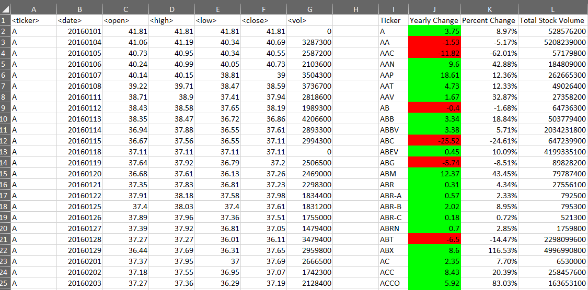
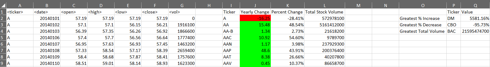
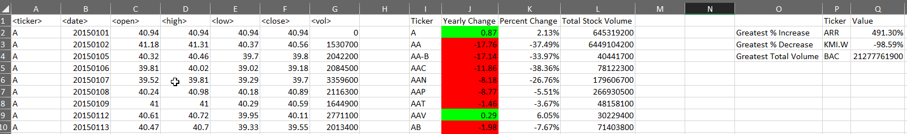
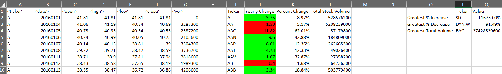

# VBA-Challenge
Repo for The VBA of Wall Street project

The file stock_stats.vbs's entire contents can be copied into a module for either the alphabetical_testing or Multiple_year_stock files once they are converted to macro enabled books by saving them as xlsm files.

Paste the code into the module in excel vba and then run it on either book and it will go through the sheets, process them and create the required stats info.  The sub "KickOf" (supposed to be KickOff...) is the main sub that starts the entire process. 

The following are screen shots from the results of running on the Multiple_year_stock workbook.

2014

2015

2016

The following are screen shots from the results of running on the Multiple_year_stock workbook that include the BONUS item results.

2014 BONUS

2015 BONUS

2016 BONUS

